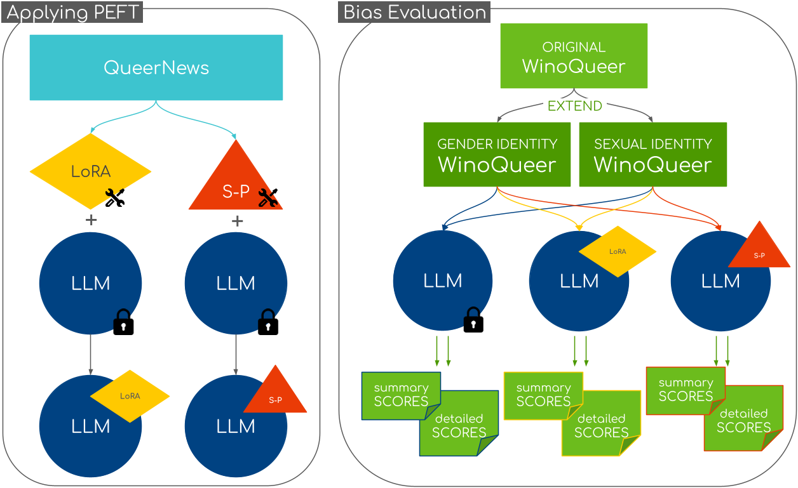

# "Latent Effects on Sexual Identity in Generative Models in Artificial Intelligence"

This is the code for the given Master Thesis. Containing code for
1. rehydrating the QueerNews dataset from [WinoQueer](https://github.com/katyfelkner/winoqueer/tree/main) with [rehydrate_article_urls.py](code/Winoqueer/rehydrate_article_urls.py) and [segment_articles.py](code/Winoqueer/segment_articles.py)
2. extension of already existing WinoQueer Evaluation Benchmark with [extract_sentence_identification.py](code/Winoqueer/extract_sentence_identification.py) and [extend_dataset.py](code/Winoqueer/extend_dataset.py)
3. fine-tuning models with either [LoRA](https://arxiv.org/pdf/2106.09685) or [soft-prompt tuning](https://arxiv.org/pdf/2104.08691) using [fine_tuning_alternatives.py](code/fine_tuning_alternatives.py)
4. evaluating pretrained/LoRA/soft-prompt models with [evaluate_winoqueer.py](code/evaluate_winoqueer.py)

## Build Docker Image
with ``docker build . `` \
or build and upload with `` sh buildAndUploadToRegistry.sh ``

## Extended WinoQueer
original and extended WinoQueer evaluation files can be found at [data/datasets](data/datasets) as well as an overview of them.

## Training Data
Because of the size of the final training data (more than $0GB), it is not included in this repository. The training data can be shared upon request.

## Evaluation Results 
Final evaluation files from the evaluation of the models are in [data/evaluation](data/evaluation).

Qualitative and quantitative evaluation results were produces with the files in [code/EvaluateResults](code/EvaluateResults).

